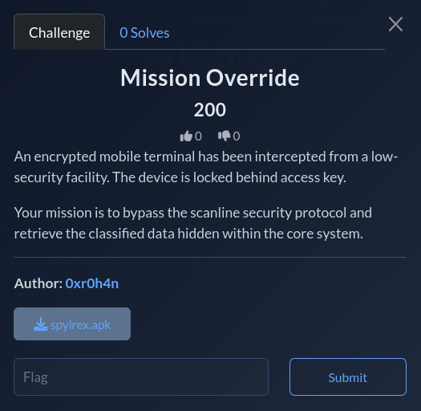

# SPYIREX-CTF

Official writeup repository for SPYIREX CTF (FLAG OVER FLOW), organized by the
Department of Cyber Security and Club CYBER NEXUS, Jerusalem College of
Engineering.

All flags follow the format `JCE{...}`.

## Event Snapshot

- Date: 24 January 2026
- Organizers: Department of Cyber Security + Cyber Nexus
- Challenge Authors: `0xr0h4n`, `Subadevan C`, `orochi`, `N1rm4l_D4rkn3ss18`, `d3xt3r`
- Categories: Cryptography, Web, Reverse Engineering, Forensics, OSINT, Steganography

## Quick Navigation

- [Reverse Engineering](./Reverse%20Engineering/README.md)
- [Web](./Web/README.md)
- [Steganography](./Steganography/README.md)
- [Forensics](./Forensics/README.md)
- [Imported PDF Artifacts](./imports/pdf_extract/README.md)

## Challenge Index

| Category | Challenge | Writeup |
| --- | --- | --- |
| Reverse Engineering | Mission Override | [Open](./Reverse%20Engineering/Mission%20Override/README.md) |
| Reverse Engineering | Twisted Validator | [Open](./Reverse%20Engineering/Twisted%20Validator/README.md) |
| Web | Gatekeeper | [Open](./Web/Gatekeeper/README.md) |
| Steganography | Point Break | [Open](./Steganography/Point%20Break/solution.md) |
| Steganography | Doom By Doom | [Open](./Steganography/Doom%20By%20Doom/solution.md) |

## Repository Standards

- Keep each challenge in its own folder.
- Include reproducible commands/scripts in each writeup.
- Use clear section headers: `Summary`, `Approach`, `Flag`.
- Preserve external links for original assets where applicable.

## Imported Material

The source PDF extraction set is available under:

- `imports/pdf_extract/source.pdf`
- `imports/pdf_extract/text/pdf_text_raw.txt`
- `imports/pdf_extract/assets/`

## Maintainer Notes

- Writeups are educational and intended for post-event learning.
- If a link is dead, open an issue using the repository issue templates.
