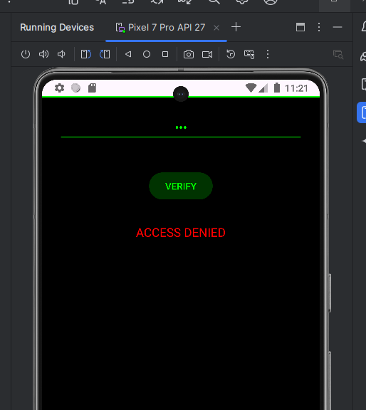
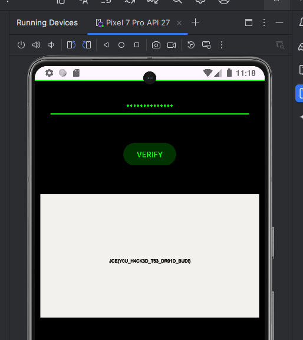

# Mission Override

## Category
Reverse Engineering

## File
`spyirex.apk`

## Difficulty
Easy

## Challenge Summary
In this challenge, you have to enter the right password in order to display the flag. Let's decompile our APK using `jadx-gui`.

## Step 1: Decompile the APK

Decompile using `jadx-gui`:



Global search (Ctrl+Shift+F), find for "MainActivity" where suspicious activities hide.

## Step 2: Locate Password Verification

Press enter or click to view the password validation:


Here's the vulnerable validation method:

```java
private boolean verify(String s) {
    int[] enc = {99, 114, 96, 96, 100, 124, 97, 119, 122, 96, 99, 114, 96, 96};
    if (s.length() != enc.length) {
        return false;
    }
    for (int i = 0; i < enc.length; i++) {
        if ((s.charAt(i) ^ 19) != enc[i]) {
            return false;
        }
    }
    return true;
}
```

## Step 3: Crack the Password

The password is hidden using XOR with key 19:



Let's recover the password:

```python
enc = [99, 114, 96, 96, 100, 124, 97, 119, 122, 96, 99, 114, 96, 96]
key = 19
password = ''.join(chr(e ^ key) for e in enc)
print(password)
```

### Output

```text
passwordispass
```

## Flag

```
JCE{Y0U_H4CK3D_T53_DR01D_BUD!}
```

## Source
Event writeup materials.
