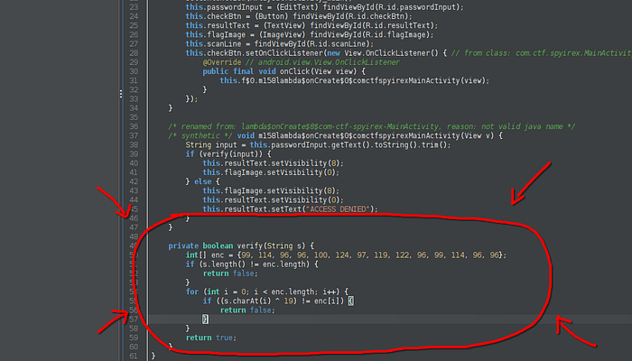

# Mission Override

## Category
Reverse Engineering

## Difficulty
Easy

## Challenge Summary
You are given an Android APK (`spyirex.apk`) that asks for a password and prints a flag when the password is correct.

## Screenshots

These screenshots are extracted from the original event PDF pages for this
challenge.





## Approach
1. Decompile the APK with `jadx-gui`.
2. Search for `MainActivity` and inspect the password validation method.
3. Recover the expected password by reversing the XOR logic.

```python
enc = [99, 114, 96, 96, 100, 124, 97, 119, 122, 96, 99, 114, 96, 96]
key = 19
password = ''.join(chr(e ^ key) for e in enc)
print(password)
```

Output:

```text
passwordispass
```

## Flag
`JCE{Y0U_H4CK3D_T53_DR01D_BUD!}`

## Source
Imported from `imports/pdf_extract/text/pdf_text_raw.txt`.
