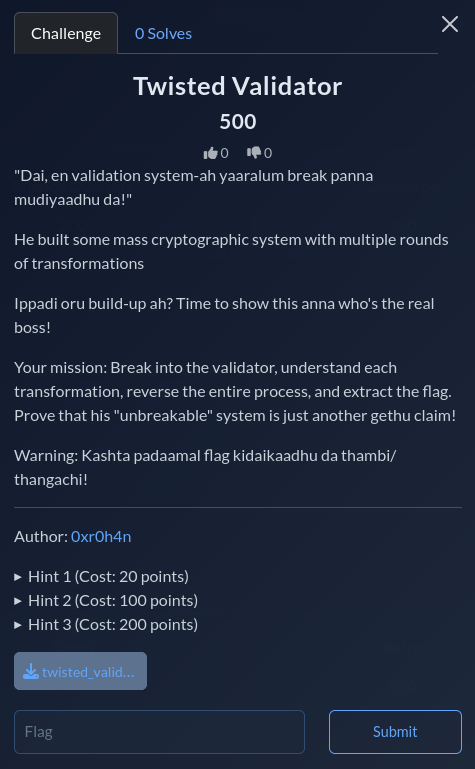

# Twisted Validator

## Category
Reverse Engineering

## File
`twisted_validator.py`

## Difficulty
Medium

## Challenge Summary
This challenge is all about Linear Congruential Generator (LCG), XORs, reversible operations, and byte manipulation. Recover the original flag by reversing a chain of byte operations: XOR mixing, byte rotation, adjacent-byte swapping, and LCG-derived keys.

## Initial Analysis

The `FlagChecker` class has several methods:
- `_mix()`: XOR operation with a key
- `_rotate()`: Rotates bytes by n positions
- `_scramble()`: Swaps adjacent bytes
- `_generate_key()`: Linear Congruential Generator (LCG) for key generation
- `process()`: Applies transformations in sequence
- `verify()`: Checks if processed flag matches expected output

## Understanding the Expected Output

This is 26 bytes — matches our flag length:

```python
expected = bytes([
    0x9e, 0x1c, 0x77, 0xd4, 0x8e, 0x97, 0x17, 0x58,
    0x73, 0x5e, 0xbe, 0x65, 0x44, 0xaf, 0x9c, 0x23,
    0x7d, 0x19, 0x6e, 0x89, 0xf2, 0x4d, 0x37, 0xc1,
    0x52, 0xa8
])
```

## Reverse the Process



To find the flag, we need to reverse each operation. Apply transformations in reverse order:

1. XOR with reversed key2
2. Unscramble adjacent swapped bytes
3. Rotate right by 7
4. XOR with key1

```python
def reverse_process(data):
    key2 = generate_key(len(data), 0x1337 ^ 0xDEAD)
    data = mix(data, key2[::-1])
    
    data = unscramble(data)
    data = rotate_right(data, 7)
    
    key1 = generate_key(len(data), 0x1337)
    data = mix(data, key1)
    
    return data
```

## Complete Solution Script

```python
def generate_key(length, seed):
    key = []
    current = seed
    for _ in range(length):
        current = (current * 1103515245 + 12345) & 0x7fffffff
        key.append(current & 0xff)
    return bytes(key)


def mix(data, key):
    return bytes(data[i] ^ key[i % len(key)] for i in range(len(data)))


def rotate_right(data, n):
    n = n % len(data)
    return data[-n:] + data[:-n]


def unscramble(data):
    result = bytearray(data)
    for i in range(0, len(result) - 1, 2):
        result[i], result[i + 1] = result[i + 1], result[i]
    return bytes(result)


expected = bytes([
    0x9e, 0x1c, 0x77, 0xd4, 0x8e, 0x97, 0x17, 0x58,
    0x73, 0x5e, 0xbe, 0x65, 0x44, 0xaf, 0x9c, 0x23,
    0x7d, 0x19, 0x6e, 0x89, 0xf2, 0x4d, 0x37, 0xc1,
    0x52, 0xa8,
])

key2 = generate_key(26, 0x1337 ^ 0xDEAD)
data = mix(expected, key2[::-1])
data = unscramble(data)
data = rotate_right(data, 7)
key1 = generate_key(26, 0x1337)
flag_bytes = mix(data, key1)

print(flag_bytes.decode("latin-1"))
```

## Output

```text
JCE{LCG_4nd_X0R_m4g1c!}
```

## Flag

```
JCE{LCG_4nd_X0R_m4g1c!}
```

## Source
Event writeup materials.
