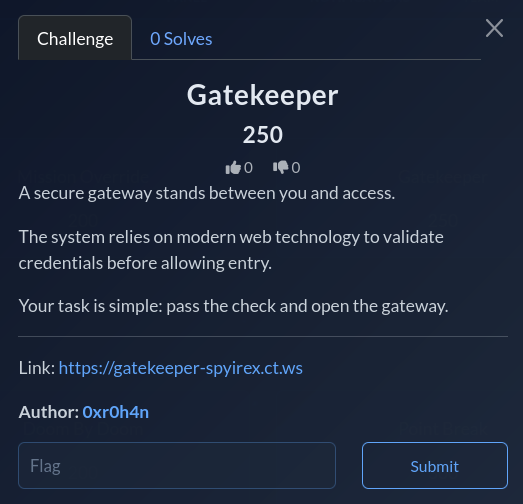

# Gatekeeper

## Category
Web

## Difficulty
Medium

## Challenge Summary
A medium WASM Web challenge. You need to login as admin with the right password to get the flag!

Site: `https://gatekeeper-spyirex.ct.ws/`

## Step 1: Register and Login as User

This is the site. Let's register and login as a user. Test the security to see if the flag reveals for normal users:



## Step 2: Observe Fake Flag

It gives us a fake flag. However, if you carefully looked at the index page, there is a button to download a WASM file (`auth.wasm`):


## Step 3: Decompile WASM

Download it and let's decompile it using `wasm2wat`:

```bash
wasm2wat auth.wasm -o auth.wat
```

The decompiled WASM contains the authentication logic encrypted with XOR operations:

```text
(module
  (type (;0;) (func (param i32 i32) (result i32)))
  (func (;0;) (type 0) (param i32 i32) (result i32)
    ...
    (data (;0;) (i32.const 0) "\\15\\04\\1b\\06\\11\\18\\07\\08\\1c\\122<(,>++*(,0\\c4\\d6\\d4")
)
```

## Step 4: Analyze the Logic

Looking at the decompiled code:


### Key Findings:

1. **Identify the password check function:**
   ```
   (export "check" (func 0))
   ```

2. **Notice the length check (which is 24):**
   ```
   local.get 1
   i32.const 24
   i32.ne
   if
     i32.const 0
     return
   end
   ```

3. **Find the encrypted data:**
   ```
   (data (i32.const 0)
     "\\15\\04\\1b\\06\\11\\18\\07\\08\\1c\\122<(,>++*(,0\\c4\\d6\\d4"
   )
   ```

4. **Understand the XOR logic:**
   ```
   key = 0x42 + (i * 3)
   if (input[i] ^ key != enc[i]) fail
   ```

## Step 5: Reverse the XOR


Since XOR is reversible:
- `enc[i] = input[i] XOR key`
- `input[i] = enc[i] XOR key`

### Reconstruct the encrypted byte array

```python
enc = [
    0x15, 0x04, 0x1b, 0x06, 0x11, 0x18, 0x07, 0x08,
    0x1c, 0x12, 0x32, 0x3c, 0x28, 0x2c, 0x3e, 0x2b,
    0x2b, 0x2a, 0x28, 0x2c, 0x30, 0xc4, 0xd6, 0xd4
]
out = ""
for i, b in enumerate(enc):
    out += chr(b ^ (0x42 + i*3))
print(out)
```

### Output

```text
WASM_IS_FOR_NERDY_PWNERS
```

This is the admin password. Let's login as admin and get the flag!

## Flag

```
JCE{Y0Ur_A_N3rDY_R3_H3R0!!}
```

## Source
Event writeup materials.
